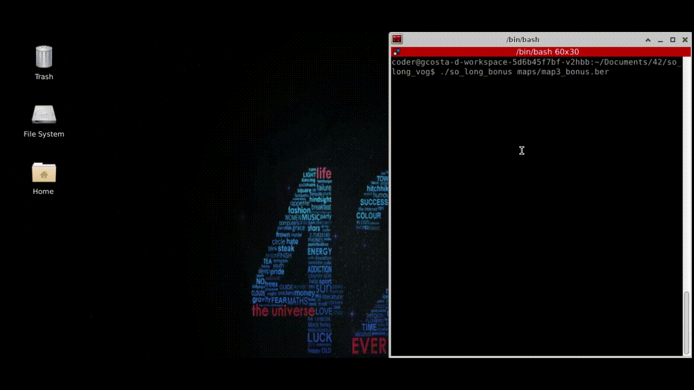
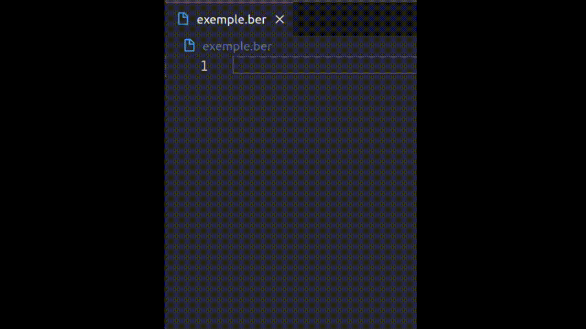

<div align="center">
	<div style="margin-bottom:3%">
		<a href="https://www.42sp.org.br/">
			
		</a>
	</div>
	<div>
		
		
		
	</div>
	<div>
		<a href="https://www.linkedin.com/in/gabriela-sertori-50b390189/">
			
		</a>
		<a href="https://github.com/gabrielasertori">
			
		</a>
	</div>
</div>

# So_long

This is the fifth project of école 42 projects.<br>
This project is a very small 2D game. It is built to make you work with textures, sprites. And some very basic gameplay elements.

<div>
	
</div>

## 🗒️ About

The game is simple, you are santa and you need to collect all the presents to, finally, go down in the fireplace. But be careful, Rudolph doesn't want to work this Christmas, so don't touch him!

## ⚙️ Run

This program use the **minilibx** library. A very specific and simple X-Window programming API in C, designed for students, suitable for X-beginners, developed for 42 graphic projects.<br>

### Installing minilibx

Official repository:
[https://github.com/42Paris/minilibx-linux](https://github.com/42Paris/minilibx-linux)

Follow the installing process steps to install the library on your machine. Otherwise the project won't run.

### Running the program

First clone the repository into your machine
```shell
https://github.com/gabrielasertori/So_long-42.git
```

Then, build the program with make or make bonus<br>
Obs.: ff you want to run the program with enemies and animations, please, pass bonus as argument to make.
```shell
make
# or
make bonus
```

After, you'll need to execute the binary with the path to the map
```shell
./so_long_bonus maps/map3_bonus.ber
```
Maps are in the maps directory.<br>
Bonus maps works weird with no bonus binary, but bonus binary works fine with any kind of map.<br>

## 🕹️ Make your own map to play the game!

You can build any map following the rules:
- The file must be a .ber file
- `1` represents walls and the map must be surrounded by them
- `0` represents valid paths
- `P` represents the player starting position
- `C` represents the collectables
- `E` represents the exit
- `Y` represents the enemies positions (only with bonus)
- It must contains at least: 1 player, 1 collectables and 1 exit
- The map must be rectangular

### Map exemple

Open your choosen IDE and create a file with .ber at the end.<br>
Write in it like the exemple below:

<div>
	
</div>

Now, execute the binary with the path to your new map:
```shell
./so_long_bonus maps/exemple.ber
```

<div>
	
</div>

## 📫 Contact

If you want to contribute with the project, please, feel free to open an issue [here](https://github.com/gabrielasertori/So_long-42/issues) followed by a pull request [here](https://github.com/gabrielasertori/So_long-42/pulls).<br>
Found any bug? Open an issue [here](https://github.com/gabrielasertori/So_long-42/issues) with the title [BUG].